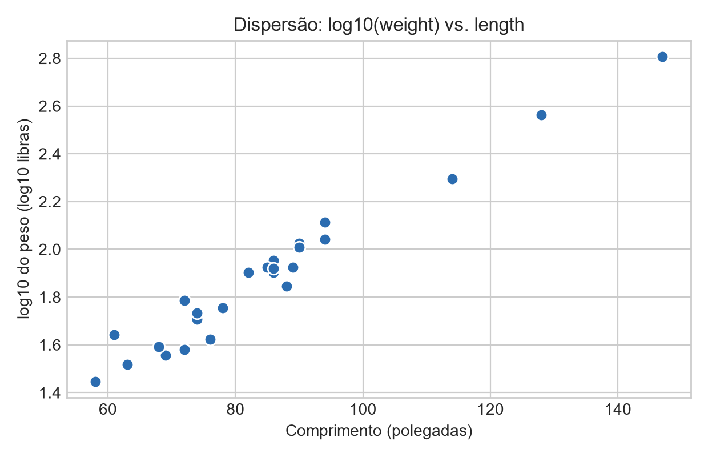
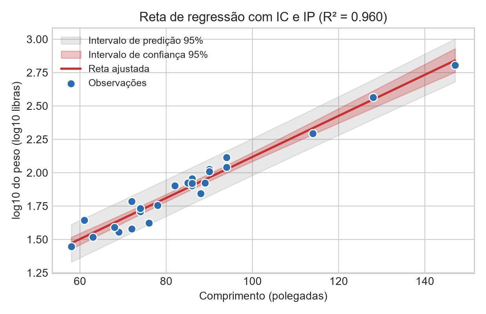
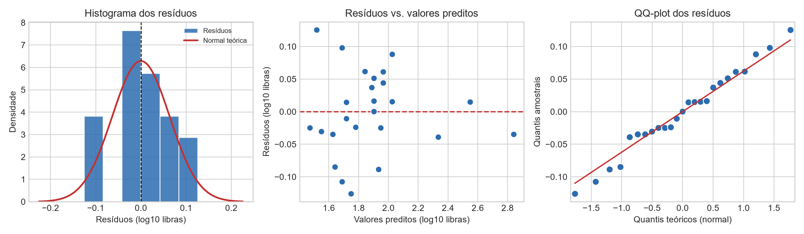
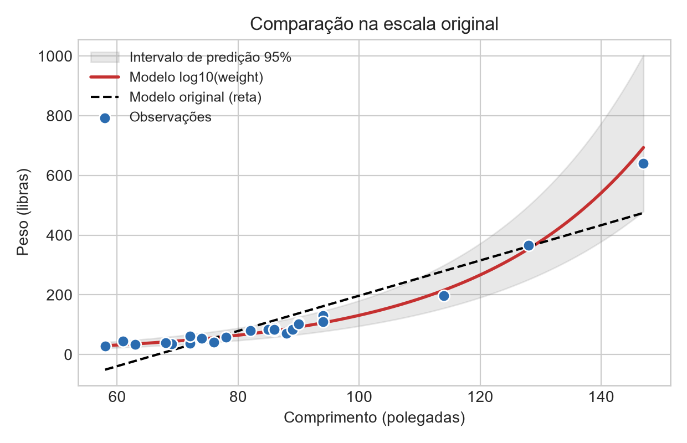
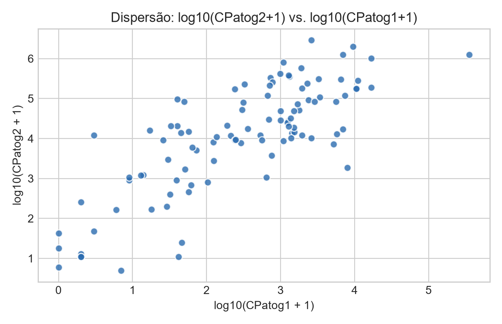
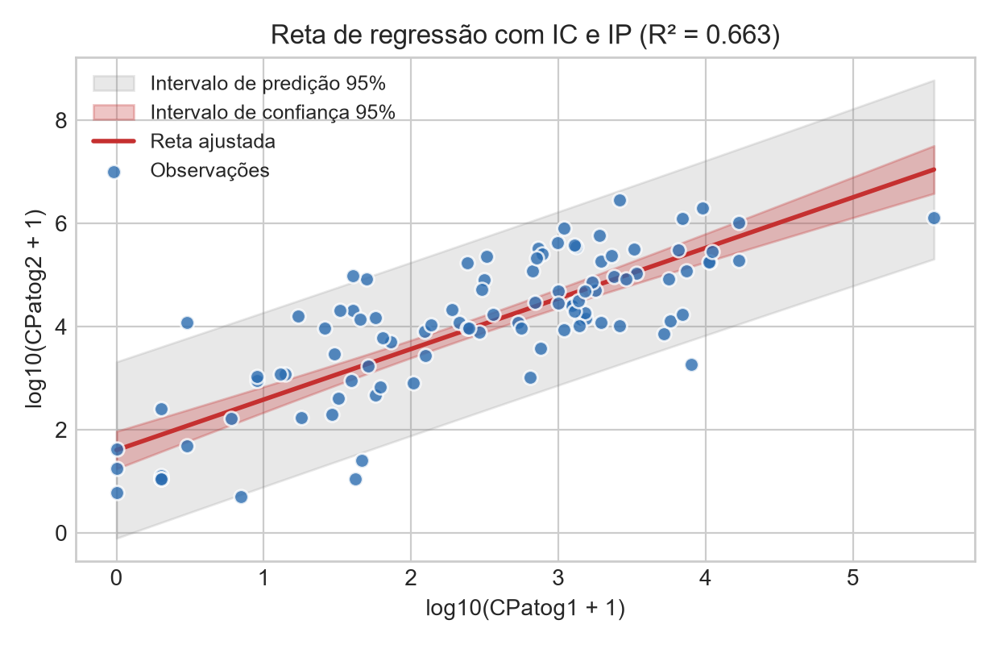
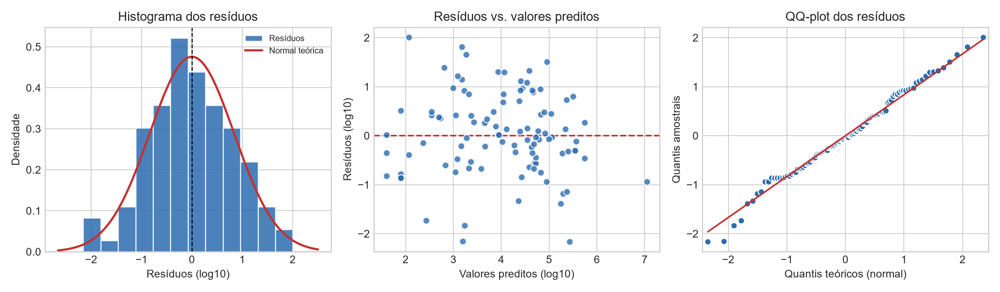
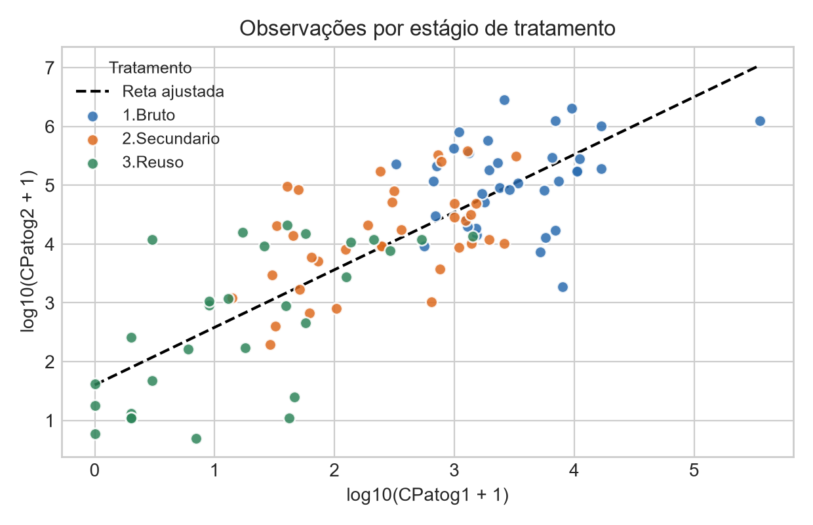

# Rascunho – Etapas 3.2 e 3.3 (Alligators e ConcPatog)

> **Rascunho.** Trechos marcados com **[REVISAR]** pedem confirmação ou ajuste de redação.
> Os caminhos das figuras são relativos a esta pasta (`relatorio/`).
> As tabelas da Etapa 3.2 são apoio para justificar a escolha. O enunciado não exige as 9 dispersões no relatório, então cabe decidir se a tabela entra ou não.

---

## 2. Dataset Alligators

### 2.2 Exploração das transformações de escala

Testamos as nove combinações pedidas: raiz quadrada, quadrado e log10, cada uma aplicada somente em X (`length`), somente em Y (`weight`) ou nas duas. Para cada combinação, avaliamos o gráfico de dispersão das variáveis transformadas e o gráfico de resíduos vs. preditos do ajuste linear. Como apoio numérico, usamos quatro indicadores:

- R² ajustado;
- o p-valor de um termo quadrático acrescentado ao modelo. Um p-valor pequeno indica que ainda resta curvatura, ou seja, que a relação não é linear;
- os testes de Shapiro-Wilk (normalidade) e de Breusch-Pagan (variância constante) sobre os resíduos.

| Transformação | Aplicada em | R² aj. | p (termo quadrático) | p (Shapiro-Wilk) | p (Breusch-Pagan) |
|---|---|---|---|---|---|
| (original) | – | 0,829 | – | – | – |
| Raiz quadrada | somente X | 0,770 | < 0,001 | 0,004 | 0,008 |
| Raiz quadrada | somente Y | 0,938 | < 0,001 | 0,184 | 0,071 |
| Raiz quadrada | X e Y | 0,901 | < 0,001 | 0,028 | 0,051 |
| Quadrado | somente X | 0,920 | < 0,001 | 0,315 | 0,001 |
| Quadrado | somente Y | 0,619 | < 0,001 | 0,003 | 0,001 |
| Quadrado | X e Y | 0,743 | < 0,001 | 0,073 | < 0,001 |
| Log10 | somente X | 0,705 | < 0,001 | < 0,001 | 0,014 |
| **Log10** | **somente Y** | **0,958** | **0,486** | **0,902** | **0,126** |
| Log10 | X e Y | 0,943 | 0,006 | 0,796 | 0,287 |

As transformações aplicadas somente em X (raiz, quadrado ou log) não corrigem o problema principal: a curvatura convexa da dispersão original, em que o peso cresce cada vez mais rápido com o comprimento, continua visível. Elevar Y ao quadrado piora a situação, porque acentua a curvatura e a dispersão dos animais maiores. As candidatas competitivas são as que comprimem Y: raiz quadrada de Y, log10 de Y e log10 nas duas variáveis.

**Combinação escolhida: log10 aplicado somente em Y, ou seja, `log10(weight) ~ length`.** Das nove combinações, é a única cuja dispersão é visualmente retilínea e que não deixa curvatura detectável (p = 0,49 para o termo quadrático). Também tem o maior R² ajustado (0,958). A combinação log10 em X e Y fica muito próxima (R² aj. = 0,943), mas ainda tem uma leve curvatura (p = 0,006). **[REVISAR]** A relação log-log corresponde ao modelo alométrico (peso ∝ comprimento^b), que seria o esperado biologicamente. Mesmo assim, nesta amostra e na faixa de comprimentos observada (58 a 147 polegadas), a transformação só em Y lineariza melhor os dados.

### 2.3 Análise da combinação escolhida: `log10(weight) ~ length`

#### Gráfico de dispersão



Depois da transformação, a associação entre `log10(weight)` e `length` é claramente **linear e positiva**. Os pontos formam uma faixa estreita e de largura aproximadamente constante ao longo de todo o eixo X. Os três animais maiores (114, 128 e 147 polegadas), que na escala original ficavam muito acima da tendência dos demais e "puxavam" a reta, agora seguem a mesma linha do resto da amostra. A maioria das observações continua concentrada entre 60 e 95 polegadas, e acima disso há poucos pontos.

#### Ajuste do modelo

```
                            OLS Regression Results
==============================================================================
Dep. Variable:             log_weight   R-squared:                       0.960
Model:                            OLS   Adj. R-squared:                  0.958
Method:                 Least Squares   F-statistic:                     553.0
No. Observations:                  25   Prob (F-statistic):           1.38e-17
Df Residuals:                      23   Log-Likelihood:                 33.965
Df Model:                           1   AIC:                            -63.93
Covariance Type:            nonrobust   BIC:                            -61.49
==============================================================================
                 coef    std err          t      P>|t|      [0.025      0.975]
------------------------------------------------------------------------------
Intercept      0.5799      0.057     10.163      0.000       0.462       0.698
length         0.0154      0.001     23.515      0.000       0.014       0.017
==============================================================================
Omnibus:                        0.053   Durbin-Watson:                   1.669
Prob(Omnibus):                  0.974   Jarque-Bera (JB):                0.255
Skew:                          -0.066   Prob(JB):                        0.880
Kurtosis:                       2.523   Cond. No.                         384.
==============================================================================
```

O modelo ajustado é

  log10(weight) = 0,5799 + 0,0154 · length.

O **R² ajustado é 0,958**: o modelo explica cerca de 96% da variabilidade de `log10(weight)`, contra 83% no modelo com os dados originais. Com base nesse indicador, podemos afirmar que o modelo captura muito bem a variabilidade da resposta, agora na escala transformada.

Na escala original, o coeficiente angular tem uma interpretação multiplicativa. Cada polegada a mais de comprimento multiplica o peso esperado por 10^0,0154 ≈ 1,036, o que equivale a um **aumento médio de cerca de 3,6% por polegada** (IC 95%: de 3,3% a 3,9%). O intercepto (10^0,58 ≈ 3,8 libras para comprimento zero) é uma extrapolação muito fora da faixa observada e não tem interpretação prática.

#### Reta de regressão com intervalos de confiança e de predição



O intervalo de confiança para a média é estreito em toda a faixa observada. Ele só se alarga perto dos extremos, principalmente acima de 110 polegadas, onde há poucos dados. Praticamente todas as observações ficam dentro do intervalo de predição de 95%. Esse intervalo tem largura de cerca de ±0,13 em log10, o que, na escala original, equivale a um fator de ×/÷ 1,36. Por exemplo, para um jacaré de 100 polegadas, o peso previsto é de cerca de 131 libras, com intervalo de predição de 95% entre 95 e 180 libras.

#### Gráficos dos resíduos



- **Histograma:** a distribuição é aproximadamente simétrica e centrada em zero (assimetria = −0,07) e acompanha razoavelmente a densidade normal. Com n = 25, o formato do histograma depende bastante da escolha das classes, então ele deve ser lido junto com o QQ-plot.
- **Resíduos vs. preditos:** os pontos se espalham aleatoriamente em torno de zero. Não há padrão curvo, como o "U" que aparecia no modelo original, nem formato de funil. Na faixa de preditos acima de 2,2 há apenas três pontos, o que torna difícil avaliar a variância nessa região.
- **QQ-plot:** os pontos seguem de perto a reta de referência em toda a extensão, sem caudas pesadas nem assimetria. Apenas 2 dos 25 resíduos estudentizados passam de |2|, o que é compatível com o esperado ao acaso (cerca de 5%).

#### Premissas LINE

| Premissa | Avaliação | Justificativa |
|---|---|---|
| **L** – Função linear | Satisfeita | A dispersão é retilínea e os resíduos vs. preditos não têm padrão. O termo quadrático não é significativo (p = 0,49). |
| **I** – Erros independentes | Plausível | Cada observação é um animal diferente, sem ordem temporal ou agrupamento conhecido. O Durbin-Watson (1,67) é próximo de 2, mas como a ordem das linhas é arbitrária, esse teste tem valor limitado. **[REVISAR]** |
| **N** – Distribuição normal | Satisfeita | O QQ-plot é praticamente retilíneo, o histograma é simétrico e o Shapiro-Wilk dá p = 0,90. |
| **E** – Variância constante | Satisfeita, com ressalva | Não há funil nos resíduos e o Breusch-Pagan dá p = 0,13. A ressalva é que há poucas observações para valores preditos altos. |

Ao contrário do modelo original, que violava L (curvatura) e E (variância crescente), o modelo com `log10(weight)` atende às quatro premissas.

#### Comparação com o modelo original (figura extra)



Na escala original (libras), o modelo transformado vira uma curva exponencial que acompanha bem os animais grandes, enquanto a reta original os subestima. A reta original também prevê pesos negativos ou muito baixos para os animais pequenos. O erro quadrático médio de previsão (RMSE) cai de **51,8 para 14,7 libras**. **[REVISAR: decidir se esta figura entra no relatório]**

---

## 3. Dataset ConcPatog

### 3.2 Exploração das transformações de escala

**Tratamento dos valores zero.** A variável `CPatog1` tem 3 observações iguais a zero (3 de 105), e nelas o log10 não está definido. Todas são do estágio de tratamento mais avançado (3.Reuso). Por isso, foram interpretadas como concentrações abaixo do limite de detecção, e não como dados ausentes. Descartá-las eliminaria justamente os menores valores da amostra e poderia enviesar o ajuste. Optamos então por usar **log10(C + 1)**, uma convenção usual para concentrações e contagens com zeros, aplicada às duas variáveis para manter a mesma escala. Como as concentrações chegam a ordens de grandeza de 10^5 a 10^6, somar 1 só altera de forma relevante os valores muito pequenos. Uma análise de sensibilidade, ajustando o modelo com log10 sem os 3 zeros (n = 102), resultou em coeficientes muito parecidos (inclinação 0,93 contra 0,98; R² aj. 0,64 contra 0,66), o que confirma que a decisão não afeta as conclusões. Esses 3 pontos também não são influentes no ajuste (distância de Cook ≤ 0,025).

| Transformação | Aplicada em | R² aj. | p (termo quadrático) | p (Shapiro-Wilk) | p (Breusch-Pagan) |
|---|---|---|---|---|---|
| (original) | – | 0,086 | – | – | – |
| Raiz quadrada | somente X | 0,176 | 0,019 | < 0,001 | 0,313 |
| Raiz quadrada | somente Y | 0,099 | < 0,001 | < 0,001 | 1,000 |
| Raiz quadrada | X e Y | 0,256 | < 0,001 | < 0,001 | 0,047 |
| Quadrado | somente X | 0,068 | 0,003 | < 0,001 | 0,860 |
| Quadrado | somente Y | 0,020 | 0,052 | < 0,001 | 0,969 |
| Quadrado | X e Y | 0,014 | 0,156 | < 0,001 | 0,900 |
| Log10(·+1) | somente X | 0,148 | 0,003 | < 0,001 | 0,055 |
| Log10(·+1) | somente Y | 0,026 | < 0,001 | < 0,001 | 0,507 |
| **Log10(·+1)** | **X e Y** | **0,660** | **0,003** | **0,685** | **0,281** |

As duas variáveis têm distribuições extremamente assimétricas, com valores que vão de unidades a centenas de milhares (CPatog1) e a milhões (CPatog2). Na escala original, quase todos os pontos ficam espremidos no canto inferior esquerdo, e alguns poucos valores extremos determinam a reta. Transformar só uma das variáveis não resolve isso, porque a outra continua concentrada perto de zero. Elevar ao quadrado agrava a assimetria. A raiz quadrada nas duas variáveis ajuda pouco (R² aj. = 0,26).

**Combinação escolhida: log10(·+1) aplicado em X e em Y, ou seja, `log10(CPatog2+1) ~ log10(CPatog1+1)`.** É a única combinação em que a dispersão mostra uma nuvem alongada com tendência linear clara, distribuída por toda a faixa de valores. Seu R² ajustado (0,660) é muito superior ao das demais, e os resíduos ficam aproximadamente normais e homocedásticos. O teste do termo quadrático (p = 0,003) aponta uma leve curvatura remanescente. Com n = 105, porém, o teste é sensível a desvios pequenos, e essa curvatura não é visível nos gráficos. **[REVISAR]**

### 3.3 Análise da combinação escolhida: `log10(CPatog2+1) ~ log10(CPatog1+1)`

#### Gráfico de dispersão



Na escala log-log há um **indício visual claro de associação linear positiva** entre as concentrações dos dois patógenos. A dispersão em torno da tendência é considerável, mas parece aproximadamente constante ao longo do eixo X. Os pontos cobrem cerca de cinco ordens de grandeza de CPatog1, sem a concentração no canto inferior esquerdo que havia na escala original. Uma única observação (CPatog1 = 354.000) fica isolada à direita, com alta alavancagem, mas não é influente (distância de Cook = 0,06).

#### Ajuste do modelo

```
                            OLS Regression Results
==============================================================================
Dep. Variable:                 log_p2   R-squared:                       0.663
Model:                            OLS   Adj. R-squared:                  0.660
Method:                 Least Squares   F-statistic:                     203.0
No. Observations:                 105   Prob (F-statistic):           4.25e-26
Df Residuals:                     103   Log-Likelihood:                -130.01
Df Model:                           1   AIC:                             264.0
Covariance Type:            nonrobust   BIC:                             269.3
==============================================================================
                 coef    std err          t      P>|t|      [0.025      0.975]
------------------------------------------------------------------------------
Intercept      1.6043      0.183      8.762      0.000       1.241       1.967
log_p1         0.9800      0.069     14.248      0.000       0.844       1.116
==============================================================================
Omnibus:                        0.076   Durbin-Watson:                   1.716
Prob(Omnibus):                  0.963   Jarque-Bera (JB):                0.069
Skew:                          -0.052   Prob(JB):                        0.966
Kurtosis:                       2.929   Cond. No.                         6.61
==============================================================================
```

O modelo ajustado é

  log10(CPatog2 + 1) = 1,604 + 0,980 · log10(CPatog1 + 1).

O **R² ajustado é 0,660**: o modelo explica cerca de 66% da variabilidade de log10(CPatog2), contra menos de 9% no modelo original. É um ganho expressivo, mas o valor é **moderado**: cerca de um terço da variabilidade continua sem explicação. Por esse indicador, o modelo captura bem a tendência geral, mas não toda a variabilidade da resposta.

O coeficiente angular (0,980, com IC 95% de 0,844 a 1,116) não difere estatisticamente de 1 (teste H₀: β₁ = 1, p = 0,77). Isso indica uma **relação aproximadamente proporcional** entre as concentrações: CPatog2 ≈ 10^1,604 · CPatog1 ≈ **40 × CPatog1**. Em outras palavras, a concentração do patógeno 2 é tipicamente cerca de 40 vezes maior que a do patógeno 1.

#### Reta de regressão com intervalos de confiança e de predição



O intervalo de confiança da reta média é estreito, ou seja, a tendência média está bem estimada. Já o intervalo de predição é largo: cerca de ±1,67 em log10, o que, na escala original, corresponde a um fator de aproximadamente **47 vezes para mais ou para menos**. Na prática, o modelo permite estimar a **ordem de grandeza** da concentração do patógeno 2 a partir do patógeno 1, mas não o seu valor com precisão em uma amostra individual. **[REVISAR: esta é a resposta à pergunta do enunciado sobre "razoável acurácia"]**

#### Gráficos dos resíduos



- **Histograma:** a distribuição é simétrica, centrada em zero e com formato próximo ao da normal (assimetria = −0,05; excesso de curtose = −0,07).
- **Resíduos vs. preditos:** os pontos formam uma faixa horizontal em torno de zero, sem funil e sem curvatura evidente. A amplitude dos resíduos é parecida em toda a faixa de valores preditos.
- **QQ-plot:** os pontos seguem a reta de referência quase perfeitamente, incluindo as caudas. 7 dos 105 resíduos estudentizados passam de |2|, valor próximo do esperado ao acaso (cerca de 5, ou 5%).

#### Premissas LINE

| Premissa | Avaliação | Justificativa |
|---|---|---|
| **L** – Função linear | Satisfeita (aproximadamente) | A dispersão é retilínea e os resíduos não mostram padrão. O teste do termo quadrático indica uma curvatura leve (p = 0,003), pequena demais para aparecer nos gráficos. |
| **I** – Erros independentes | **Questionável** | As amostras se agrupam por estação de tratamento (3 ETEs), estágio de tratamento (bruto, secundário e reuso) e mês, então não são observações independentes. Os resíduos médios variam significativamente entre meses (ANOVA dos resíduos por mês: p = 0,004), mas não entre ETEs (p = 0,66) nem entre estágios (p = 0,15). O Durbin-Watson (1,72) tem valor limitado aqui, porque a ordem das linhas segue o agrupamento e não o tempo. |
| **N** – Distribuição normal | Satisfeita | O QQ-plot é retilíneo, o histograma é simétrico e o Shapiro-Wilk dá p = 0,69. |
| **E** – Variância constante | Satisfeita | Não há funil nos resíduos e o Breusch-Pagan dá p = 0,28. |

No modelo original, as premissas L, N e E eram fortemente violadas. Com a transformação log-log, L, N e E passam a ser atendidas, e **I continua sendo a principal limitação**, por causa da estrutura de agrupamento dos dados.

#### Observações por estágio de tratamento (figura extra)



Quando os pontos são coloridos pelo estágio de tratamento, fica claro que eles se organizam ao longo da reta conforme o estágio. O esgoto bruto ocupa a região de concentrações mais altas, o efluente secundário fica na região intermediária e a água de reuso, na região mais baixa. Isso significa que **parte considerável da associação global vem do próprio processo de tratamento**, que reduz os dois patógenos ao mesmo tempo. Quando a regressão é ajustada separadamente dentro de cada estágio, a relação fica bem mais fraca:

| Estágio | n | Inclinação | p-valor | R² |
|---|---|---|---|---|
| 1. Bruto | 36 | 0,32 | 0,147 | 0,06 |
| 2. Secundário | 36 | 0,64 | 0,002 | 0,26 |
| 3. Reuso | 33 | 1,09 | < 0,001 | 0,52 |

Assim, o modelo global serve para estimar a ordem de grandeza de CPatog2 a partir de CPatog1 considerando todos os estágios juntos. Dentro de um mesmo estágio, principalmente no esgoto bruto, CPatog1 tem pouco poder preditivo sobre CPatog2. Um modelo que incluísse o estágio de tratamento como variável explicativa provavelmente seria mais adequado, mas isso foge do escopo da regressão linear simples pedida na atividade. **[REVISAR: decidir se esta discussão e a figura entram no relatório]**
